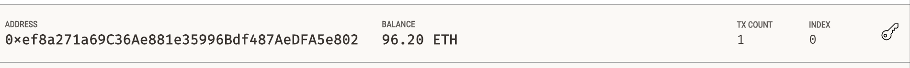
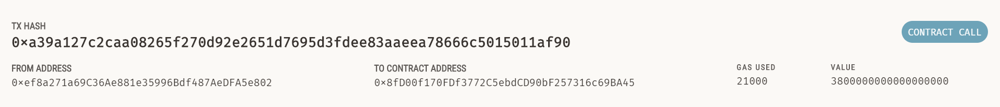

# Cryptocurrency_Wallet

This repo demonstrates integrating the Ethereum Blockchain into an application that enables customers to pay hired FinTech professionals.

## Technologies Required

To run the Python files you are required to install Streamlit, Web3 and bip44.

## Results

The screenshots above show a successful transaction whereby a FinTech professional named Jo was hired for 20 hours at a rate of 0.19 ETH per hour.

## Contributors

Owen Harris.